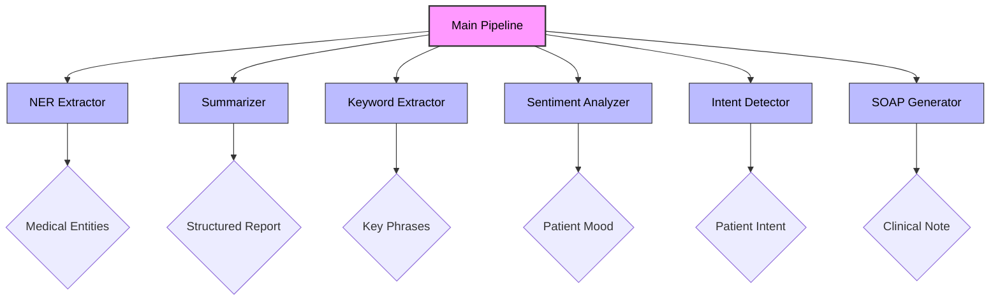
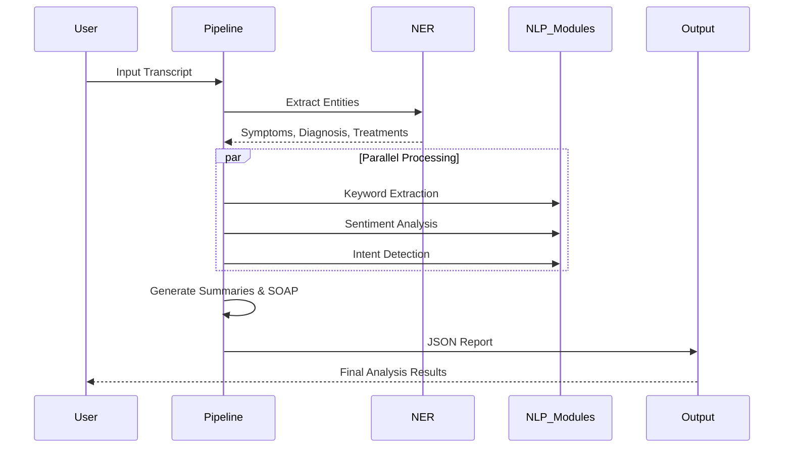

# Physician Notetaker

An AI-powered NLP pipeline for **medical transcription analysis**, **summarization**, and **sentiment analysis** of physician-patient conversations.

## 🎯 Features

| Module | Description |
|--------|-------------|
| **NER Extraction** | Extract Symptoms, Diagnosis, Treatment, Prognosis |
| **Text Summarization** | Generate structured medical reports in JSON |
| **Keyword Extraction** | Identify important medical phrases |
| **Sentiment Analysis** | Classify patient sentiment (Anxious/Neutral/Reassured) |
| **Intent Detection** | Identify patient intent (Seeking reassurance, Reporting symptoms, etc.) |
| **SOAP Notes** | Generate structured clinical documentation |

## 🏗️ System Architecture



## 🔄 Processing Flow



## 📦 Installation

```bash
# Clone the repository
cd "Physician Notetaker"

# Create virtual environment
python -m venv venv

# Activate virtual environment
# Windows:
.\venv\Scripts\activate
# Linux/Mac:
source venv/bin/activate

# Install dependencies
pip install -r requirements.txt

# (Optional) Install spaCy model for enhanced NER
python -m spacy download en_core_web_sm
```

## 🚀 Quick Start

### Run the Complete Pipeline

```bash
python main.py
```

This will analyze the sample transcript and output:
- Medical entities (NER)
- Structured summary
- Keywords
- Sentiment analysis
- Intent detection
- SOAP note

### Use in Python

```python
from main import PhysicianNotetaker

# Initialize pipeline
pipeline = PhysicianNotetaker()

# Analyze a transcript
transcript = """
Doctor: How are you feeling today?
Patient: I had a car accident. My neck and back hurt a lot.
Doctor: Did you receive treatment?
Patient: Yes, I had physiotherapy sessions.
"""

results = pipeline.analyze(transcript)
print(results['structured_summary'])
```

### Single Statement Analysis

```python
# Analyze sentiment and intent of a single statement
result = pipeline.analyze_sentiment_only(
    "I'm worried about my back pain, but I hope it gets better."
)
# Output: {"Sentiment": "Anxious", "Intent": "Seeking reassurance"}
```

## 📁 Project Structure

```
Physician Notetaker/
├── main.py                      # Main pipeline orchestrator
├── requirements.txt             # Python dependencies
├── sample_transcript.txt        # Sample conversation
├── physician_notetaker.ipynb    # Jupyter notebook demo
└── src/
    ├── __init__.py
    ├── ner_extractor.py         # Named Entity Recognition
    ├── summarizer.py            # Text summarization
    ├── keyword_extractor.py     # Keyword extraction
    ├── sentiment_analyzer.py    # Sentiment classification
    ├── intent_detector.py       # Intent detection
    └── soap_generator.py        # SOAP note generation
```

## 📊 Sample Output

### Structured Summary

```json
{
  "Patient_Name": "Ms. Jones",
  "Symptoms": ["Neck Pain", "Back Pain", "Head Impact"],
  "Diagnosis": "Whiplash Injury",
  "Treatment": ["10 physiotherapy sessions", "Painkillers"],
  "Current_Status": "Occasional backache",
  "Prognosis": "Full recovery expected within six months"
}
```

### Sentiment & Intent Analysis

```json
{
  "Sentiment": "Anxious",
  "Intent": "Seeking reassurance",
  "Confidence": 0.85
}
```

### SOAP Note

```json
{
  "Subjective": {
    "Chief_Complaint": "Neck and back pain",
    "History_of_Present_Illness": "Patient had a car accident..."
  },
  "Objective": {
    "Physical_Exam": "Full range of motion, no tenderness",
    "Observations": "Patient appears in good health"
  },
  "Assessment": {
    "Diagnosis": "Whiplash injury",
    "Severity": "Mild, improving"
  },
  "Plan": {
    "Treatment": "Continue physiotherapy as needed",
    "Follow_Up": "Return if symptoms worsen"
  }
}
```

## 🧠 Technical Approach

### NER Extraction
- **Pattern matching** with medical vocabulary dictionaries
- **Optional spaCy integration** with SciSpacy medical models
- Custom entity categories: Symptoms, Diagnosis, Treatment, Prognosis

### Sentiment Analysis
- **Rule-based lexicon matching** with medical-specific indicators
- **Optional transformer support** (DistilBERT) for enhanced accuracy
- Categories: Anxious, Neutral, Reassured

### Intent Detection
- **Hybrid approach**: Pattern matching + keyword analysis
- Intent categories: Seeking reassurance, Reporting symptoms, Expressing concern, Asking questions, Providing information

### SOAP Note Generation
- **Speaker identification** (Doctor vs Patient)
- **Section-specific keyword detection**
- **Template filling** with extracted information

## 📚 Theory Questions

### Handling Ambiguous/Missing Data
- Use confidence scores to flag uncertain extractions
- Generate "Unknown"/"Not mentioned" for missing fields
- Use contextual cues from surrounding text

### Pre-trained Models for Medical NLP
- **SciSpacy** (en_core_sci_lg) - Medical NER
- **BioBERT/ClinicalBERT** - Biomedical pre-training
- **BART/T5** fine-tuned on clinical datasets

### Fine-tuning BERT for Medical Sentiment
1. Collect medical conversation datasets with labels
2. Add classification head on BERT pooled output
3. Use domain-adaptive pre-training on medical text
4. Apply focal loss for class imbalance

### Datasets for Healthcare Sentiment
- MIMIC-III clinical notes
- i2b2 annotated clinical text
- MedQuAD medical Q&A pairs

## 📄 License

MIT License